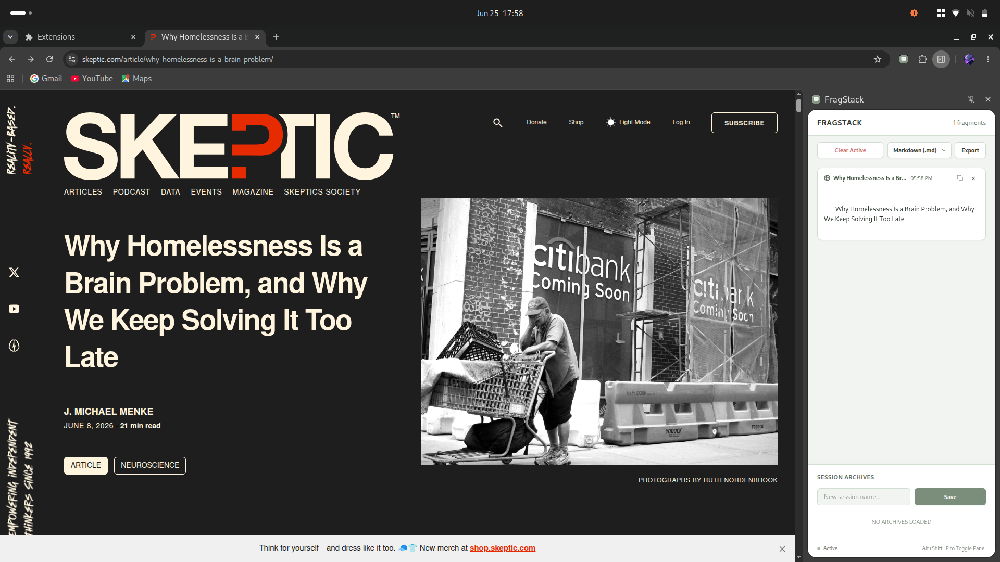

# FragStack

> Keyboard-driven research clipboard. Collect, reorder, and export text fragments directly in your side panel.

---

## What it does

When conducting research online, saving whole pages is overkill, and bookmarking URLs doesn't capture the specific paragraphs you care about. Copy-pasting to a separate text document forces you to constantly switch windows.

FragStack opens a persistent side panel in your browser. Select any text on a page and press `Alt + Shift + S` to send it straight to your research stack. Drag-and-drop to reorder fragments, edit them inline, and export them as Markdown, Plain Text, or beautifully formatted HTML.

---

## Install

> Load manually in Developer Mode:

1. Download the extension source files
2. Go to `chrome://extensions` → enable **Developer Mode** (top right)
3. Click **Load unpacked** → select the `FragStack` directory containing `manifest.json`

Done. The icon appears in your toolbar.

---

## Shortcuts

| Action | Shortcut Key | Description |
|---|---|---|
| **Capture Snippet** | `Alt + Shift + S` | Captures selected text immediately and adds it to the active stack. |
| **Toggle Side Panel** | `Alt + Shift + P` | Opens or closes the FragStack panel instantly in the current window. |

---

## Features

- Hotkey-driven snippet capture (`Alt + Shift + S`) or via right-click context menu selections
- Persistent side panel workspace that remains open as you navigate between tabs
- Drag-and-drop card reordering powered by SortableJS
- Inline editing of captured snippets with auto-saving on blur and validation indicators
- Multi-format exports:
  - **Markdown (`.md`)**: Formatted with source URLs and timestamps, ready for Obsidian or Logseq
  - **Plain Text (`.txt`)**: Text blocks with clean structural dividers
  - **Web Page (`.html`)**: Beautiful, print-to-PDF-ready document preserving CSS variables
- Workspace archives — name and save different research stacks, clear active stacks, and restore them later
- Fading UI scrollbar that hides when idle to keep the visual panel clean

---

## Stack

`Vanilla JS` · `Manifest V3` · `SortableJS` · `Chrome Side Panel API` · `Chrome Storage API`

---

## License

MIT
